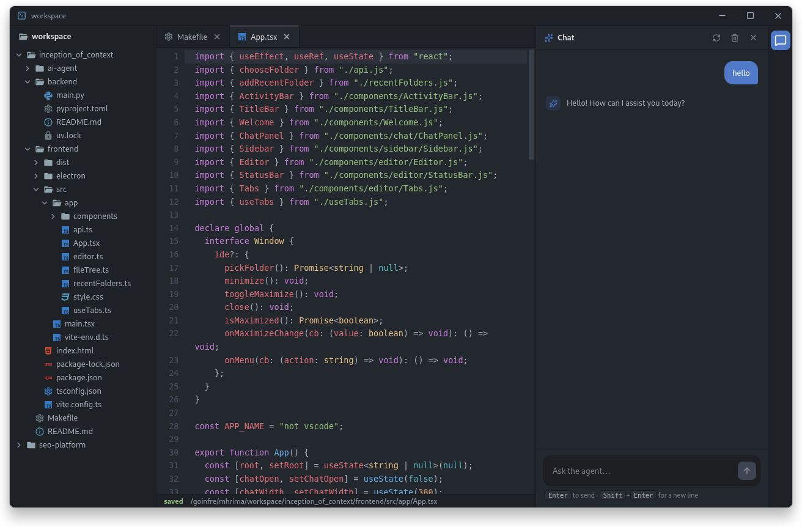

# mini IDE

A small desktop IDE that lets you open a folder, browse its file tree, edit
files in a CodeMirror editor, autosave changes back to disk, and ask a built-in
AI agent about the code.



## Architecture

The app is three connected services:

- `frontend/` — Electron + React + Vite + TypeScript desktop app.
  - CodeMirror 6 editor with a custom dark theme and syntax highlighting.
  - React Query for filesystem requests and cache invalidation.
  - Debounced autosave (280 ms) with saved / saving / error status.
  - Chat panel that talks to the agent through the backend.
- `backend/` — FastAPI service on `127.0.0.1:8000`.
  - Local filesystem API: list, read, write, create, delete, rename.
  - Proxies chat requests to the agent (`AGENT_URL`, default
    `127.0.0.1:8001`).
- `ai-agent/` — FastAPI service on `127.0.0.1:8001`.
  - RAG agent over the open project (LangGraph + Chroma + Ollama).
- `Makefile` — install, build, and run targets.

## Requirements

- Node.js and npm
- Python 3.13 and [uv](https://docs.astral.sh/uv/)

## Setup

```bash
make install
```

Installs all three services: `npm install` in `frontend/`, `uv sync` in
`backend/`, and a `uv` venv with `requirements.txt` in `ai-agent/`.

## Usage

Run the whole app (agent on `:8001` and backend on `:8000` in the background,
Electron in the foreground):

```bash
make app
```

Quitting the app or pressing Ctrl-C frees ports 8000 and 8001.

### Individual services

```bash
make frontend   # build + launch Electron only
make backend    # FastAPI filesystem API on :8000
make agent      # AI agent on :8001
```

## Filesystem API

The backend exposes the following endpoints:

| Method | Endpoint         | Description                 |
| ------ | ---------------- | --------------------------- |
| GET    | `/api/fs/list`   | List entries in a directory |
| GET    | `/api/fs/read`   | Read a text file            |
| PUT    | `/api/fs/write`  | Write content to a file     |
| POST   | `/api/fs/create` | Create a file or directory  |
| POST   | `/api/fs/rename` | Rename a file or directory  |
| DELETE | `/api/fs/delete` | Delete a file or directory  |

## Cleanup

```bash
make clean
```

Removes `dist/` and `node_modules/` from `frontend/`, and the `.venv/` and
`__pycache__/` directories from `backend/` and `ai-agent/`.
