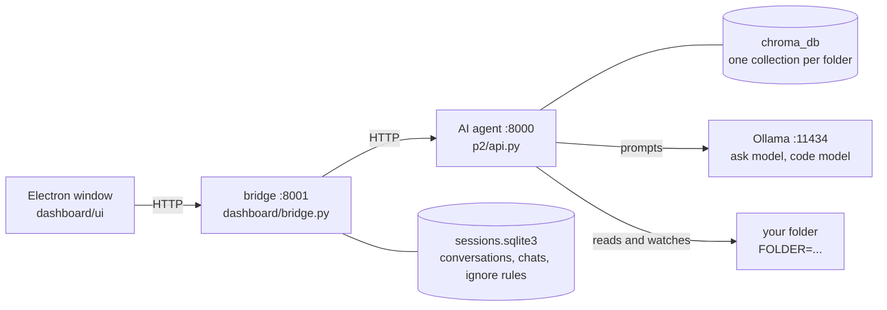
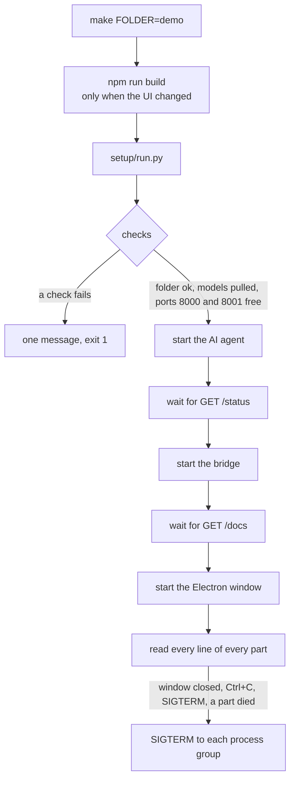
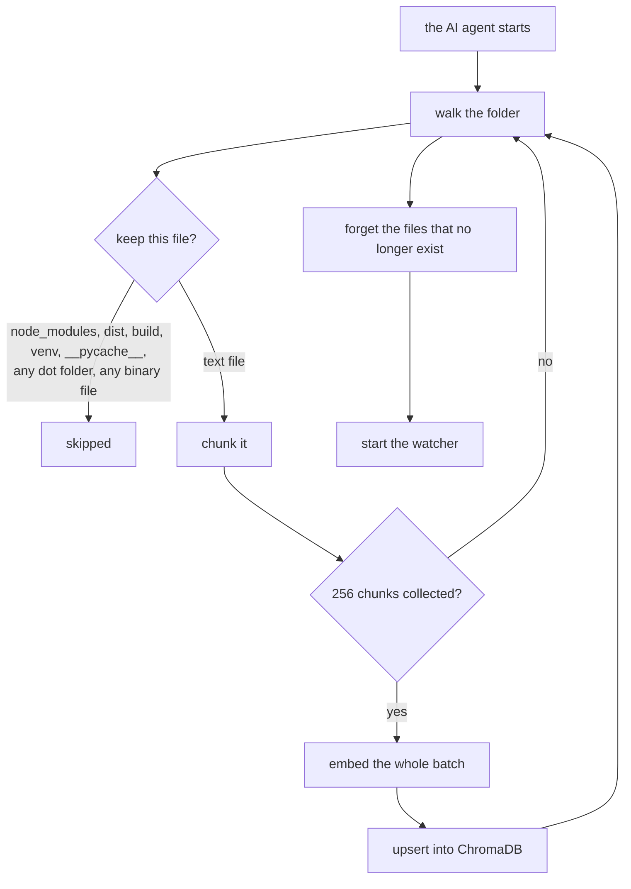
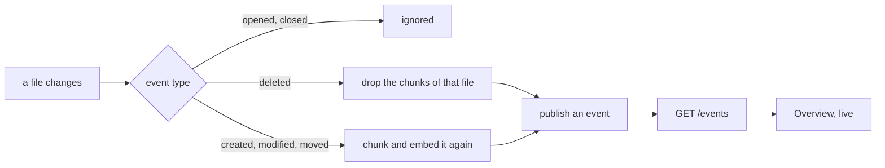
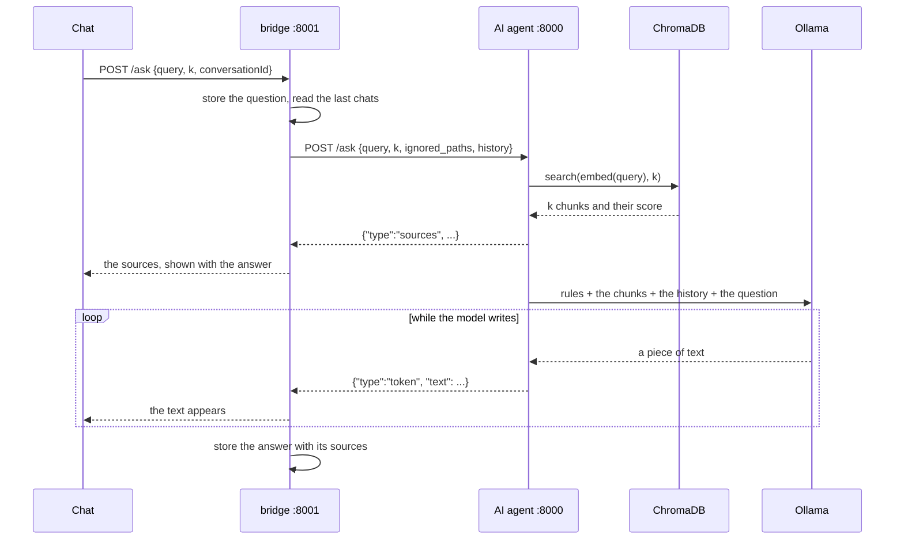
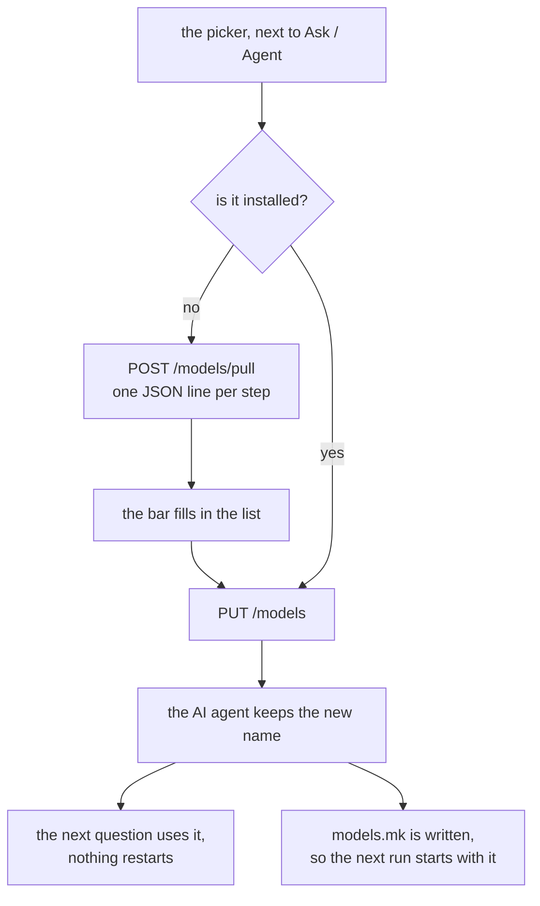
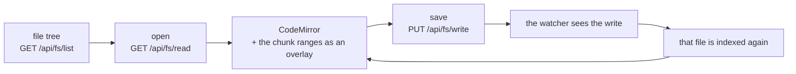
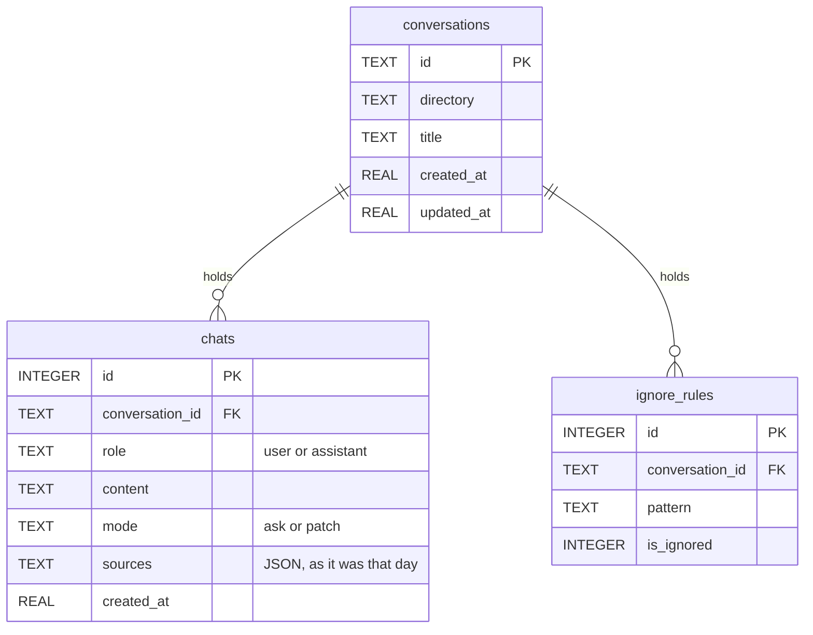
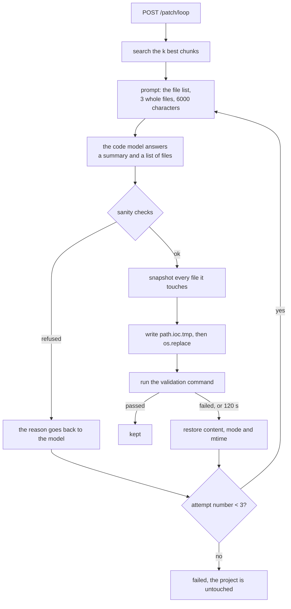
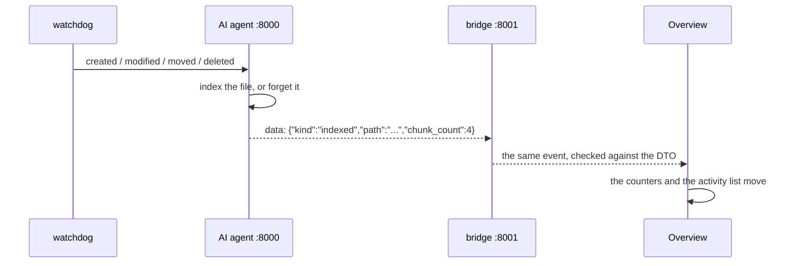

# Inception of Context

A local AI coding agent for a folder of your choice: it indexes the code, answers questions about
it with the files it used, and writes patches that it validates or rolls back. Everything runs on
your machine — the models through Ollama, the vectors in ChromaDB — inside an Electron IDE.

## Quick start

```bash
make install          # picks the models for this machine, creates .venv, npm install
make FOLDER=demo      # starts everything and opens the window
make logs             # the last run again, with colors
```

| You need | Why |
|---|---|
| Linux, `make` | the entry points |
| `uv`, Python 3.13 | `.venv` and the packages |
| Node 20.19+, `npm` | the Electron window (Electron 44, Vite 8) |
| Ollama running | the two models, `ollama serve` |
| ~4 GiB free disk, 8 GiB RAM | one 3B model resident, no GPU needed |
| Network, the first time only | pulls the models and the embedding model |

| View | What it is for |
|---|---|
| **Editor** | file tree, tabs, an editor, and the chat with the agent beside it |
| **Overview** | what is indexed, and what the watcher does, live |
| **Explorer** | every chunk in the store, page by page |
| **Ask** | a question, the answer, and the chunks it came from |
| **Patch** | run the patch loop and read every attempt |
| **the picker** | in the chat: switches the model of Ask or of Agent, and pulls a new one |

| Target | What it does |
|---|---|
| `make install` | models, `.venv`, `npm install` |
| `make FOLDER=<folder>` | starts the three parts and the window |
| `make logs` | the last log again |
| `make tests` | `tests/test_index.py`, `tests/test_patch_loop.py` |
| `make clean` | `.venv`, `node_modules`, `dist`, caches |
| `make fclean` | `clean` plus `chroma_db`, `sessions.sqlite3`, `models.mk`, `.logs` |

## The map



The window never talks to the AI agent directly. The bridge owns the file system, the
conversations and the ignore rules, and forwards the rest, checking every answer against its own
DTOs.

```
p1/         chunk a file, embed it, keep it in ChromaDB, watch the folder
p2/         the AI agent API: status, files, chunks, context, ask, events, patch
p3/         the patch loop: generate, check, apply, validate, roll back
dashboard/  bridge.py (:8001) and ui/ (React + Electron)
setup/      pick the models, then run everything (run.py)
tests/      the index and the patch loop
demo/       a tiny project to point FOLDER at
```

## How a run starts

`setup/run.py` owns the whole run. The Makefile only calls it.



Every line of every part lands in one file, `.logs/<date>_<time>.log`, and `.logs/latest.log`
points at the newest one:

```
ai-agent:  17:04:11 INFO    indexed 629 chunks
server:    17:04:12 WARNING 127.0.0.1 - "GET /file?path=gone.py" 404 Not Found
run:       17:04:12 INFO    everything is running, close the window or press Ctrl+C to stop
```

The level comes from the line itself: the `LEVEL:` uvicorn writes, a traceback, an exception, or
the status code of a request. Colors are added in the terminal only, so the file stays plain text.

When the folder you open *contains this repository*, the log is written outside it. The watcher
indexes every file that changes, so a log inside the folder would index itself and never stop.

## How the code is indexed



| Fact | Value |
|---|---|
| A chunk | one function or class in Python, otherwise 40 lines |
| Its id | `path::qualified_name`, made unique when a name repeats |
| Embedding | `sentence-transformers/all-MiniLM-L6-v2`, offline once cached |
| Distance | cosine, one collection per folder (`codebase_<sha256(path)[:16]>`) |
| Batch | 256 chunks per embed call and per upsert |
| Client | one ChromaDB client per process, shared by the API and the watcher |

The index is rebuilt at every start, so it can never drift from the folder. A start of this
repository (629 chunks) takes about 13 s, most of it real embedding work.

## How the watcher keeps it fresh



`opened` and `closed` are ignored on purpose: reading a file in order to index it fires them, so
reacting to them would send the indexer back to the same file forever.

## How a question is answered



| Fact | Value |
|---|---|
| Chunks retrieved | `k = 5` by default |
| History sent | the last 5 chats, 500 characters each |
| Transport | NDJSON: one `sources` line, then one line per piece of text |
| Ignored paths | the ignore rules of that conversation, applied before the search |
| Stored sources | file, lines, score and content, copied into the chat |

A chat keeps its own sources, so an old answer still shows what it used even after the code
changed.

## Choosing the model

Two models run the project: one answers questions (**Ask**), one writes patches (**Agent**). The
picker sits next to the Ask/Agent toggle in the chat and changes the model of the mode you are in,
while the project runs.



| Mode | What its model does | Field |
|---|---|---|
| **Ask** | answers questions about the code | `ask_model` |
| **Agent** | writes the patches of the patch loop | `code_model` |

The list holds what Ollama already has, plus the models `make install` knows about
(`setup/ollama_models.py`). An installed model shows the RAM it takes once loaded; a missing one
shows its download size and is pulled when you pick it, with the progress in the row. Nothing is
downloaded until you click.

## The editor



| Action | Route |
|---|---|
| list a folder | `GET /api/fs/list` |
| read a file | `GET /api/fs/read` |
| save a file | `PUT /api/fs/write` |
| new file or folder | `POST /api/fs/create` |
| rename | `POST /api/fs/rename` |
| delete | `DELETE /api/fs/delete` |

These routes take an absolute path, so the bridge listens on `127.0.0.1` only. The tree shows
the folder you opened and hides `node_modules`, `.git` and `__pycache__`. The patch loop is the
strict one: it refuses any path outside the folder or ignored in the conversation.

## Conversations and ignore rules



Ignore rules belong to one conversation: a path switched off in the tree is dropped from the
search and refused by the patch loop, for that conversation only. `node_modules`, `.git`, `dist`,
`build`, `venv`, `.venv`, `__pycache__`, `chroma_db` and the usual caches are off from the start.

## The patch loop



The model never sees a diff: it is given whole files and answers whole files. A patch is written
to `path.ioc.tmp` and moved with `os.replace`, so a file is never half written.

**The refusals.** A patch that hits one of these is never applied; the reason is sent back to the
model as feedback for the next attempt.

| # | Refused because |
|---|---|
| 1 | a file contains the markers of the prompt |
| 2 | `create` on a file that already exists |
| 3 | a non-empty file would become `""`, `None` or `null` |
| 4 | a new function has only a stub body (`pass`, `...`, `return None`) |
| 5 | a file would shrink by more than 60 % |
| 6 | more than 3 files are touched |
| 7 | the patch has no file to change |
| 8 | nothing needs to change (the answer is the summary) |
| 9 | `modify` or `delete` on a file that does not exist |
| 10 | a path is outside the project |
| 11 | a path is ignored in this conversation |
| 12 | the same path is in the patch twice |
| 13 | the file to modify is not a text file |
| 14 | the model answer is not a valid patch |

**The validation.** Put an `ioc.config.yml` at the root of the folder you open:

```yaml
validation:
  command: pytest -q {files}
```

`{files}` is replaced by the files the patch changed. Without that file, the baseline runs
`python -m py_compile {files}` on the changed `.py` files. The command runs in the folder, with a
120 s limit; on failure or timeout every file goes back to the exact bytes, mode and mtime it had.

## Live events



Server-Sent Events, not polling: the window is told when something happens and stays idle the rest
of the time.

## Routes

**AI agent, `:8000`** (`p2/api.py`)

| Route | Answers |
|---|---|
| `GET /status` | chunks indexed, folder, models, whether the watcher runs, files |
| `GET /models` | the two chosen models, and every model with its size |
| `PUT /models` | change the ask model, the code model, or both |
| `POST /models/pull` | NDJSON: the download of one model, step by step |
| `GET /files` | every indexed file with its number of chunks |
| `GET /file?path=` | the chunks of one file |
| `GET /chunks?offset=&limit=` | a page of chunks |
| `POST /context` | the k chunks closest to a query |
| `POST /ask` | NDJSON: the sources, then the answer as it is written |
| `GET /events` | SSE, what the watcher did |
| `POST /patch/loop` | the attempts, the sanity result, the validation, what was kept |

**The bridge, `:8001`** (`dashboard/bridge.py`)

| Route | Answers |
|---|---|
| `/api/fs/*` | list, read, write, create, rename, delete inside the folder |
| `GET POST /conversations` | list them, start one |
| `GET PATCH DELETE /conversations/{id}` | read it, add chats, delete it |
| `GET PUT /conversations/{id}/ignore-rules` | read and set the ignore rules |
| `/status` `/files` `/file` `/chunks` `/context` `/patch/loop` | forwarded, answer checked |
| `GET PUT /models`, `POST /models/pull` | forwarded: read the models, change them, pull one |
| `/ask` `/events` | forwarded as a stream, and stored on the way |

## Settings

| What | Where | Default |
|---|---|---|
| `ASK_MODEL`, `CODE_MODEL` | `models.mk`, written by `make install` and by the picker | picked from your RAM and GPU |
| `MODEL_THREADS` | environment | a third of your cores, at least 2 |
| `TARGET_PATH` | set by `setup/run.py` | `FOLDER=` |
| validation command | `ioc.config.yml` in the folder you open | `python -m py_compile {files}` |

`MODEL_THREADS` exists because Ollama took 8 of 20 cores for a single answer and the machine
crawled.

## When it does not work

| What you see | What it is |
|---|---|
| `port 8000 is already in use` | another run is open; close its window or Ctrl+C its terminal |
| `<model> is not pulled or Ollama is not running` | `ollama serve`, then `make install-models` |
| the first start hangs on the embedding model | it is downloaded once; after that every start is offline |
| answers are slow | the folder is large, or another run holds the cores |
| the window opens empty | the UI was not built: `make FOLDER=<folder>` builds it when it changed |

## The subject

| Part | Where |
|---|---|
| Part 1 — index the code | `p1/` |
| Part 2 — serve it and answer | `p2/` |
| Part 3 — the patch loop | `p3/` |
| Chapter V — a real application | `dashboard/` |
