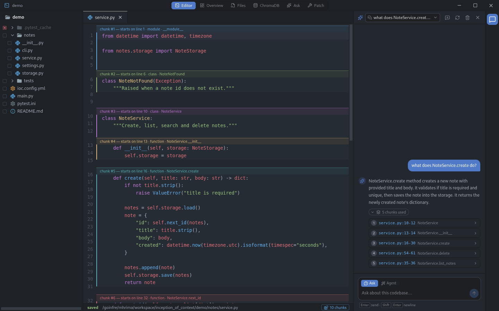

# Inception of Context

A local-first RAG coding agent over a target project. It indexes a codebase into
ChromaDB, answers questions about it with a local LLM, and proposes, applies and
validates patches — rolling the project back if it cannot get to green.

Everything runs on your machine. No remote LLM service is contacted.



```
p1/   indexing        AST chunking, embeddings, ChromaDB, file watcher
p2/   Architect API   FastAPI on :8000, plus the desktop dashboard
p3/   patch loop      propose -> sanity -> apply -> validate -> roll back
fix/  fixes           bug fixes for p1/ and p2/ modules, which stay unchanged
demo/ target project  a small Python notes app to point the agent at
```

The target codebases are **Python** projects.

## Quick start

```bash
make up      # start the API in Docker, then open the desktop app
make down    # stop the API
```

`make up` runs the Architect API and Ollama in containers — the isolated
environment the subject asks for — pulls the two models, and opens the dashboard
as a **desktop application**. Closing the window leaves the API running;
`make down` stops it.

The API's OpenAPI docs are at **http://127.0.0.1:8000/docs**.

The two models are named in `p2/llm_object.py`:

```
qwen2.5:3b          answers (Ask tab, chat)
qwen2.5-coder:3b    patches
```

`make up` pulls them into the Ollama container. Without Docker, run
[Ollama](https://ollama.com) yourself and `ollama pull` both.

A missing model returns a 503 naming the exact command to run — a request is
never blocked on a multi-gigabyte download. Both models are ≤3B, as the subject
requires. The embedding model (`all-MiniLM-L6-v2`, 88 MB) is baked into the
image, so embeddings work offline after the build.

To point the agent at your own project instead of the demo:

```bash
TARGET_PROJECT=/path/to/your/project make up
```

Host folders are mounted into the container at **the same absolute path** they
have on your machine, because the desktop app runs outside the container but
browses files through the API. `make up` mounts the top-level folders that hold
your home directory and the project (on 42 machines: `/home` and `/goinfre`), so
any folder under them can be opened from the app.

## Running without Docker

```bash
make install    # uv sync + npm install
make api        # the Architect API on :8000, on the host
make index      # index the demo, then watch it (TARGET_PROJECT=... to change)
make app        # build the dashboard and open it as a desktop window
```

Requires Python 3.13 with [uv](https://docs.astral.sh/uv/), and Node.js. This is
the quicker loop for development; `make up` is the one to demo.

## Part 1 — indexing

Index a folder into `chroma_db/`, then watch it for changes:

```bash
uv run python -m fix index demo          # or: make index
```

This runs the `p1/index.py` flow through `fix/index.py`.

The API indexes and watches its `TARGET_PROJECT` on startup too, through the
same code; stop the API before running the CLI, since both open `chroma_db/`.

Chunking is **logical, not fixed-size**: the AST is walked so a function, a
method or a class header is one chunk, with a regex fallback for files that do
not parse. Chunks deliberately **overlap** — a class chunk covers the class
header up to its first method, and each method is its own chunk.

Indexing is incremental. Chunks are keyed `path::qualified_name` and skipped
when their content hash is unchanged, so re-running on an untouched tree
performs zero embeddings. Deleted files are removed from the collection, so the
agent cannot cite code that no longer exists.

Skipped: `node_modules`, `.git`, `dist`, `build`, `venv`, `.venv`,
`__pycache__`, every hidden directory, and binaries. **The vector store is never
indexed or watched.**

## Part 2 — the Architect API

FastAPI on `:8000`. Full schema at `/docs`.

| Route | Purpose |
|---|---|
| `GET /status` | chunk count, target path, models, watcher state |
| `GET /files` | indexed files with per-file chunk counts |
| `GET /file?path=` | one file's source plus its chunk boundaries |
| `GET /chunks?offset=&limit=` | paginated view of the whole collection |
| `POST /context` | top-k chunks with similarity scores, no LLM |
| `POST /ask` | streamed answer grounded in retrieved context |
| `GET /events` | SSE feed of index activity |
| `POST /index`, `/index/path`, `/index/forget` | index or forget a path |
| `POST /patch/propose`, `/patch/apply`, `/patch/loop` | see Part 3 |
| `GET·POST·PATCH·DELETE /conversations…` | stored transcripts |
| `/api/fs/*` | local filesystem, for the desktop editor |

### Dashboard tabs

The dashboard is an Electron desktop app (`p2/dashboard`). The Editor tab needs
an open project; the other five read the index directly and work without one.

- **Overview** — chunk count, target path, embedding and LLM models, per-file
  chunk counts, and a live activity feed over SSE.
- **Files** — every indexed file; selecting one shows its source with a `▶`
  gutter marker at each chunk boundary.
- **ChromaDB Explorer** — page through the collection, expand any row to see the
  exact stored document.
- **Ask & Retrieve** — a **k** selector on the form, with separate *Retrieve*
  (chunks and distances only) and *Ask LLM* buttons.
- **Patch Loop** — run the Part 3 loop and watch each attempt.

Answers are grounded: context blocks are labelled with file, line range and
symbol, and the model is told to say what it would need to see rather than
invent a symbol that is not in the index.

## Part 3 — the patch loop

A patch is JSON: `{summary, files: [{path, op, content}]}` where `op` is
`create`, `modify` or `delete` and `content` is the **complete** post-change
file.

The loop runs at most **three** attempts:

```
propose -> sanity check -> snapshot -> apply atomically -> validate
     ^                                                        |
     +------------------ feed the error back -----------------+
```

If no attempt validates, **the project is rolled back to the exact state it was
in before the loop started** — a file the model created is deleted, a file it
deleted comes back with its original mode, and a snapshot taken on attempt 2
never overwrites the attempt-1 baseline.

Files are written via `*.ioc.tmp` and `os.replace`, so a crash mid-write cannot
leave a half-written file.

**Sanity checks refuse a patch that** leaks retrieval markers into file content,
creates a file that already exists, replaces a non-empty file with `""`/`None`/
`null`, leaves a function body as a stub (`pass`, `...`, `return None`), shrinks
an existing file by more than 60%, or touches more than 3 files.

### Validation

The command comes from `ioc.config.yml` at the target project's root:

```yaml
validation:
  command: python -m pytest -q
  timeout: 120
```

Without that file the loop uses the subject's baseline,
`python -m py_compile {files}`, where `{files}` is replaced by the files the
patch created or modified. Any command in `ioc.config.yml` can use `{files}` too.

## Tests

```bash
make test        # 64 tests: rollback, sanity refusals, validation, the loop, fixes
make demo-test   # the demo project's own 8 tests
```

The rollback tests are the important ones — they assert the project is
byte-identical after a failed loop, including the mixed create/modify/delete
case.

## Configuration

`.env` at the repository root:

| Variable | Default | Meaning |
|---|---|---|
| `OLLAMA_HOST` | `http://127.0.0.1:11434` | where Ollama listens |
| `TARGET_PROJECT` | `./demo` | project indexed and watched at startup |
| `IOC_DATA_DIR` | `./.data` | conversations, snapshots |
| `HOST` / `PORT` | `127.0.0.1` / `8000` | API bind address |

The models (`qwen2.5:3b`, `qwen2.5-coder:3b`) and the embedder
(`all-MiniLM-L6-v2`) are set in `p2/llm_object.py` and `p1/embedder.py`, not in `.env`. The index lives in
`chroma_db/`, everything else under `IOC_DATA_DIR`; both are gitignored — no model weight, embedding archive or populated ChromaDB directory
is ever committed.
